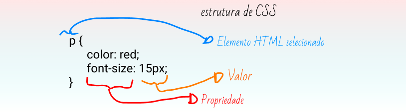
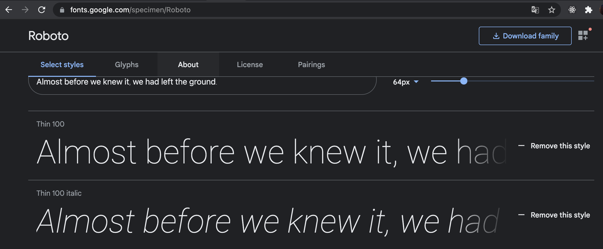
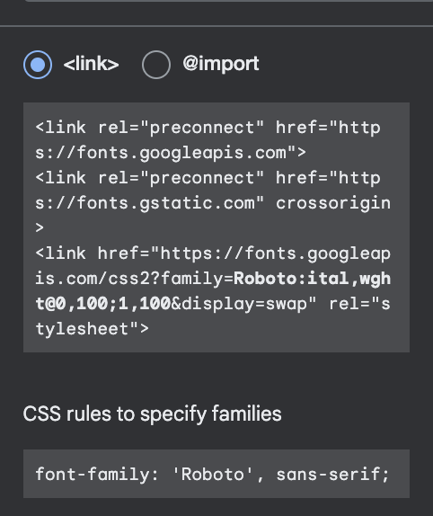
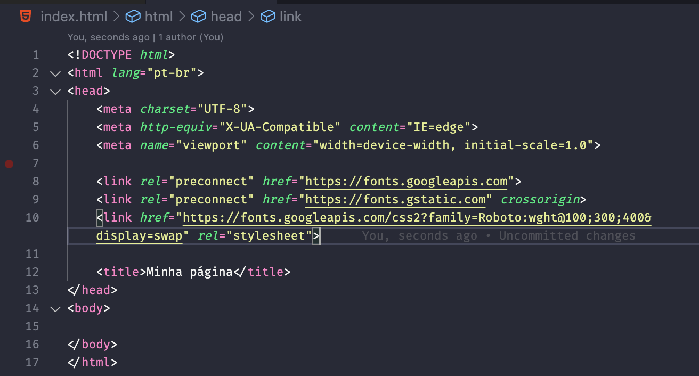

# CSS Land

Olá, sou Bianca e sou estudante de Análise e Desenvolvimento de Sistemas pela Universidade Anhembi Morumbi, também estudo UI/UX como extensão do meu curso. Atualmente sou estagiária Front-End na empresa Avenue Code há pouco mais de 8 meses, que foi quando iniciei a minha transição de carreira. Tenho um projeto voluntário chamado O [Leitura de Bolso](https://www.leituradebolso.com.br/) que nasceu para democratizar a literatura no Brasil. No nosso projeto, as pessoas podem ler livros que estão em domínio público pelo telegram.

[Twitter](https://twitter.com/biancaenrose) | [Linkedin](https://www.linkedin.com/in/ramalhobianca/) | [Twitch](https://www.twitch.tv/biancaenrose) | [Instagram](https://www.instagram.com/biancaenrose/)

O motivo de eu criar esse documento é para registrar minha evolução na aprendizagem de tecnologias as quais estou trabalhando e, talvez, ajudar quem precisa.

### Sobre CSS

**CSS (Cascading Style Sheets)**, é uma linguagem de folha de estilo que não precisa ser interpretada pelo navegador, apenas estiliza o conteúdo que marcamos em HTML para a estética da sua explicação. Com ela criamos e mudamos propriedades como as fontes, imagens, cores de fundo, estilo de elementos e etc, que usamos na construção de um website. É tudo sobre propriedade: valor. CSS3 é a versão mais recente do CSS e oferece vantagens mais recentes nos quesitos fonte, cor e vários outros recursos de background e borda. Mas assim como o HTML5, nem todos os navegadores são compatíveis com CSS3.

Ela está entre as principais linguagens da web e é padronizado em navegadores de acordo com as Especificações [W3C](https://www.w3.org/Style/CSS/#specs). Anteriormente, o desenvolvimento de várias partes da especificação CSS era feito de forma síncrona, o que permitia o controle de versão das recomendações mais recentes. 

A syntax de CSS é basicamente composta por:

- **Propriedade**, que é o que queremos mudar como fonte, tipo de fonte, cor, tamanho da fonte e etc, existem inúmeras propriedades, mas não será necessário decorá-las, somente o essencial. E;

- **Valores**, que é o que queremos atribuir para a propriedade. Como no exemplo abaixo: 



Para fazer esse código CSS funcionar, precisamos aplicar o arquivo CSS, que eu tenho certeza que você leu que precisa ser um arquivo separado lá no [HTML](https://github.com/biancaramalho/about-html), né ao documento HTML na tag "head". Caso contrário, o estilo não mudará a aparência do HTML. Ta bom, vou te dar um exemplo mas preste atenção que eu só vou fazer uma vez, hein?!

A outra forma de adicionar CSS ao documento HTML e atribuir um estilo para a sua página é escrevendo em uma tag dentro da tag ```<head></head>``` do seu documento html como no exemplo abaixo:

```<p style=" "></p>```

Quando trabalhamos com isso, dizemos que é inline CSS, embora essa não seja a forma correta de criar um projeto limpo e organizado. Por isso, criamos um arquivo apenas para CSS, outro apenas para HTML e outro apenas para JavaScript e atribuí-lo no documento HTML. (Ilustração dos arquivos e atribuição ao html).

- Abra seu arquivo ```index.html``` e **escreva** a seguinte linha no cabeçalho (mais específicamente na tag ```<head></head>```):

Óbvio que o nome do arquivo tem que estar de acordo com o que você nomeou, o meu, neste caso, está nomeado como "estilo.css" e está na pasta raíz. Por isso não precisei iniciar a referência com "./" ou algo do tipo.

### Anatomia CSS

Observado na figura acima, você deve ter reparado que a syntax do CSS sempre tem que ter dois pontos antes do valor e ponto e vírgula depois do valor. Toda essa estrutura é chamada de conjunto de regras, que você também pode se referir como somente "regra", tanto faz. Observe abaixo como selecionar os elementos HTML a serem estilizados:

**Seletor**

Se refere ao elemento HTML no início da regra, no exemplo da figura, é o "p". Ele define o elemento que será estilizados.

**Declaração**

É basicamente a propriedade e o valor que você irá atribuir para esse elemento HTML, por exemplo ```font-size: 15px;```, esse conjunto de regras é o que chamamos de uma declaração. Ela especifica quais propriedades do elemento você deseja estilizar.

**Propriedades**

Elas definem o estilo do elemento HTML, no exemplo da figura, formata o tamanho da fonte para 15 pixels. Enfim, você escolhe quais propriedades deseja afetar na regra.

**Valor**

É o que vem em seguida da propriedade - mais especificamente após os dois pontos (:) - é o valor da propriedade. Isso escolhe uma das muitas aparências possíveis para uma determinada propriedade. Por exemplo, existem muitos tamanhos de fonte além do pixel.

Observe as outras partes importantes da syntax:

- Além do seletor, cada conjunto de regras deve ser colocado entre chaves ({});
- Em cada declaração, você deve usar dois-pontos (:) para separar a propriedade de seu valor como no exemplo na figura acima;
- Em cada conjunto de regras, você deve usar um ponto-e-vírgula (;) no final do valor para separar cada declaração da próxima que virá a seguir. Dessa forma: 

```
    p {
        color: red;
        font-size: 15px;
        width: 500px;
        border: 1px solid black;
    }
```

Você também pode selecionar vários elementos e aplicar uma única regra a todos eles. Separe vários seletores por vírgulas. Por exemplo:

```
    p, h1, h3 {
            color: red;
            font-size: 15px;
            width: 500px;
            border: 1px solid black;
    }
```

### SELETORES E ATRIBUTOS

Seletores é por onde você seleciona o elemento HTML que deseja estilizar, individualment (ou não) e existem vários tipos de seletores no CSS que permitem maior controle de correspondência entre irmãos (depois explico sobre hierarquia e DOM, prometo). Isso traz maior flexibilidade que permite mais funções entre os elementos. Isso torna todo o processo mais intuitivo e interconectado, tornando o resultado muito mais impressionante.

Os exemplos acima usam seletores de elemento (p, h1, body, header e etc), como você observou, eles selecionam todos os elementos mais generalizado. Mas também podemos fazer seleções mais específicas com classes e IDs, por exemplo. Veja abaixo os tipos mais comuns de seletores:

**OBS:** Trabalhar com classes e IDs requer bastante atenção pois existem diferenças entre elas que irei mostrar na tabela abaixo, mas só para você entender um pouco melhor, irei especificar como esses dois seletores (que são os mais comuns) funcionam:

- **Classe**: Pode ser usada quantas vezes for necessário no seu CSS, é mais flexível para trabalhar e não tem restrição de uso. No elemento HTML, escrevemos "class" dentro da tag, dessa forma: ```<p class="minha-classe"></p>```. No CSS é escrito com um ponto (.) na frente do elemento selecionado, exemplo: 

```
    .minha-classe {
        color: red;
    } 
```

- **ID**: Pense numa ID como se fosse uma identidade, isso é individual e não é transferível, certo? Pois no CSS a regra não é diferente, IDs só podem ser usadas uma única vez (de preferência, no máximo, duas vezes em cada documento HTML), por ser algo muito mais específico e individual. No elemento HTML, escrevemos igual fazemos com o class, escrevemos o ID dentro da tag assim: ```<header id="minha-id"></header>```. No CSS é escrito com uma hash (#) na frente do elemento. Exemplo: 

``` 
    #minha-id {
        color: red;
    }
```

Abaixo estão outros exemplos de seletores mais comuns para você observar com carinho:

Seletor | O que seleciona | Exemplo
------------ | ------------- | -------------
Seletor de elemento (tag ou tipo) | Elementos HTML especificado como body, h1, header... | ``` p (selecionou a tag <p>)``` 
Seletor de ID | O elemento com um ID atribuído. Lembre-se que ID devem ser únicos | ``` #meu-id (selecionou <p id="meu-id">)```
Seletor de classe | Elementos com uma classe específica. Essa poderá ser instanciada o tanto de vezes que achar necessário. | ```.minha-classe (seleciona <p class="minha-classe">```
Seletor de atributo | O elemento com o atributo obrigatório como imagens, por exemplo. | ```img[src] (seleciona )```
Seletor de pseudo classe | Elemento por estado especificado. Quando um cursor passa sobre um link e ele muda de cor, por exemplo. | ```a:hover (seleciona a tag de link <a>, mas apenas quando o ponteiro do mouse está pairando sobre o link.```

Existem muitos outros seletores para você explorar á vontade. Para saber mais, consulte o [guia Seletores MDN](https://developer.mozilla.org/en-US/docs/Learn/CSS/Building_blocks/Selectors). 

### Fontes e texto

As fontes deixam uma estética mais atrativa e chamam mais a atenção do público que tiver acessando a sua página. Nós já vimos que essa combinação é feita com CSS e para aprender como funciona, vou te mostrar abaixo.

Para nós que estamos começando, é aconselhável utilizar o [Google Fonts](https://fonts.google.com/) para utilizar as fontes que deseja estilizar em sua página, lembre-se de sempre ir em busca de fontes livres de copyright para não lhe dar problemas futuros, viu?! Pois continuando: 

1. No seu documento HTML, dentro da tag ```<head></head>``` adicione a tag ```<link />``` em qualquer lugar que achar necessário, mas precisa ser dentro da "head". É mais ou menos assim:

```<link href="https://link-da-font-que-voce-escolheu" rel="stylesheet">``` 

Geralmente você acha o link correspondente da font do Google Fonts que deseja para adicionar na sua página aqui: 



Você clica na fonte desejada, depois vai aparecer uma lista de vários estilos da fonte que você escolheu. Em seguida, seleciona o estilo que deseja inserir em sua página naquele botão com sinal de "+" no canto da página, onde está escrito "+ Select this style". Assim que selecionar os estilos, clica naquele botão do canto direito com três quadrados e um sinal de "+" embaixo, do lado da engrenagem, e abrirá uma seção com todas as informações da fonte, download e enfim, mas o que você irá copiar é este link para embutir a fonte na sua página: 



Depois que copiou, irá colar na tag "head" do seu documento HTML. Ficando assim:



Observe que as tags com os links do Google Fonts estão separadas para facilitar a sua leitura de como tem que ficar. 