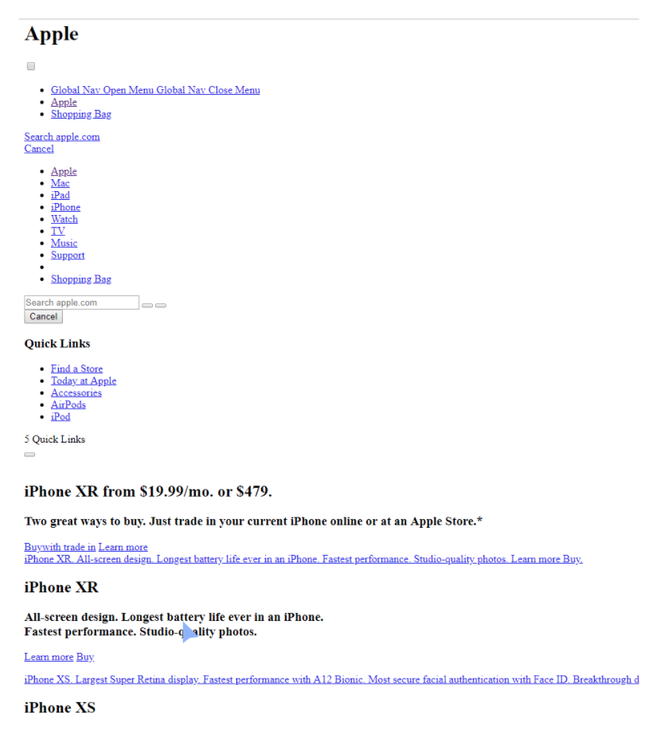
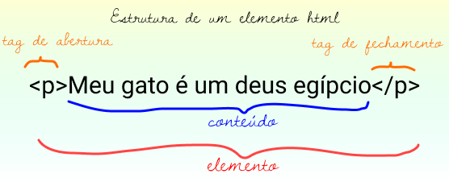
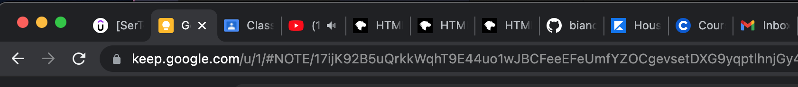
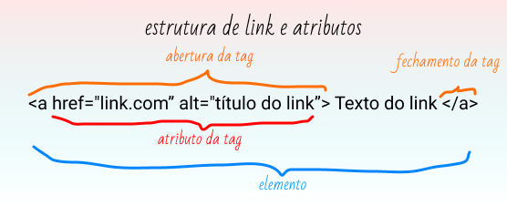

# HTML Land

Olá, sou Bianca e sou estudante de Análise e Desenvolvimento de Sistemas pela Universidade Anhembi Morumbi, também estudo UI/UX como extensão do meu curso. Atualmente sou estagiária Front-End na empresa Avenue Code há pouco mais de 8 meses, que foi quando iniciei a minha transição de carreira. Tenho um projeto voluntário chamado [O Leitura de Bolso](https://www.leituradebolso.com.br/) que nasceu para democratizar a literatura no Brasil. No nosso projeto, as pessoas podem ler livros que estão em domínio público pelo telegram.

[Twitter](https://twitter.com/biancaenrose) | [Linkedin](https://www.linkedin.com/in/ramalhobianca/) | [Twitch](https://www.twitch.tv/biancaenrose) | [Instagram](https://www.instagram.com/biancaenrose/) 

O motivo de eu criar esse documento é para registrar minha evolução na aprendizagem de tecnologias as quais estou trabalhando e, talvez, ajudar quem precisa.

### Sobre HTML
Conhecido também como **HTML (HyperText Markup Language)** é uma linguagem de marcação que permite ser lida por algo (não necessariamente os navegadores, mas na maioria dos casos eles são os que mais leem). Passando brevemente pela história da HTML, ela foi criada por **Tim Berners-Lee**, um físico do centro de pesquisas **CERN**, na Suíça. Ela surgiu com a ideia de um sistema de hipertexto na internet, quando a mesma começou a se expandir. De acordo com o Elemento de Referência do HTML, do Mozilla Developer Network, atualmente existem 140 tags HTML, mesmo que algumas delas já estejam obsoletas (não mais suportadas pelos navegadores). Mas obviamente não decoramos tudo isso de tag, apenas as principais, se quisermos saber mais detalhes, pode consutar o site [html.com](https://html.com/).Disecando o significado de cada palavra: 

*"Hipertext"* refere-se a links que conectam páginas umas às outras, dentro de um único site ou entre eles. Os navegadores as interpretam para que sua aplicação seja exibida na tela e por isso é uma linguagem de marcação, mas não é de programação.

*"Marcação" ou "Markup"* para anotar texto, imagens e outro conteúdo que serão exibidos em um navegador. HTML consiste em uma série de elementos que usamos para incluir ou agrupar diferentes partes de um conteúdo para fazê-lo aparecer ou agir de uma determinada maneira.

O **HTML5** é a versão mais recente do HTML e sua função é dizer ao navegador qual é o conteúdo que está escrito. Mas infelizmente nem todos os navegadores são compatíveis com certas versões recentes das linguagens. Por isso existem outros recursos para converter versões de compatibilidade entre os navegadores, mas isso é assunto para outra ocasião.

#### Este é o site da apple apenas com HTML ativado

Eu sei que o HTML parece ser tedioso mas é muito necessário e compensador passarmos por todas as etapas de aprendizado na construção de projetos.



### Anatomia do HTML

Se temos HTML no website, então temos um website funcional. A syntax básica de HTML é chamada de **"Tag"**. Calma que eu te explico, as "Tags" são como pacotinhos que precisam ser abertos e fechados e mostram ao navegador o que é cada coisa como observamos na representação da imagem abaixo.

 

Toda a estrutura do parágrafo ```(<p>texto</p>)``` É como se fosse um livro, e como sabemos, um livro possui uma capa com algumas páginas dentro, e em cada página temos títulos, subtítulos, parágrafos, imagens, desenhos, números, tópicos e etc. Por exemplo:

``` 
    <capa>
    </capa>
```

### As principais partes do nosso elemento são as seguintes:

- **Tag de abertura**: Consiste no nome do elemento (neste caso, 'capa') envolvido nesses sinais de maior e menor (<>). Isso indica onde o elemento começa a ter efeito.

- **Tag de fechamento**: É a mesma que a tag de abertura, exceto que inclui uma barra antes do nome do elemento (</>). Isso indica onde o elemento termina. Pelo amor de Odin, se você esquece de adicionar essa tag de fechamento (é um erro bem comum no início, aliás) pode acabar em um erro de syntax. Então se lembre sempre de fechar as tags.

- **Conteúdo**: O nome já diz, certo? É o conteúdo do elemento, que, neste caso, está vazio. Mas se voltar lá na imagem do parágrafo ```(<p>)```, perceberá que existe apenas um texto: "Meu gato é um deus egípcio" - este é o conteúdo da sua tag.

- **Tag de fechamento**: É a mesma que a tag de abertura, exceto que inclui uma barra antes do nome do elemento (</>). Isso indica onde o elemento termina. Pelo amor de Odin, se você esquece de adicionar essa tag de fechamento (é um erro bem comum no início, aliás) pode acabar em um erro de syntax. Então se lembre sempre de fechar as tags.
- **Conteúdo**: O nome já diz, certo? É o conteúdo do elemento, que, neste caso, está vazio. Mas se voltar lá na imagem do parágrafo ```(<p>)```, perceberá que existe apenas um texto: "Meu gato é um deus egípcio" - este é o conteúdo da sua tag.

- **Elemento**: A tag de abertura, a tag de fechamento e o conteúdo juntos constituem o elemento, simples assim.

Certo, então voltando ao exemplo do livro, dentro da capa existem páginas que iniciam e terminam, correto? E Normalmente não temos apenas uma página, temos várias delas.

```
    <capa>
        <page></page>
        <page></page>
        <page></page>
    </capa>
```

Note que não consigo deixar uma dessas páginas ```(<page></page>)``` independente, se isso acontecesse, se tornaria uma tag perdida, é como se deixássemos uma página solta nesse livro. E a falta de informação é algo que não queremos, não é mesmo? Por isso ter todo o seu conteúdo devidamente fechado é algo muito importante.

### Anatomia de um documento HTML
Toda vez que iniciamos um documento HTML, precisamos especificar para o navegador qual é o tipo do documento que estamos criando para que seja devidamente interpretado por ele. Portanto, todo o documento HTML inicia com: ```<!DOCTYPE html>```, É obrigatório. Uma breve história sobre: Lá por volta de 1991/92, quando o HTML era apenas um bebê, os doctypes atuavam como links (conexões) para um conjunto de regras que essas páginas tinham que seguir para ser consideradas um bom HTML, mas hoje são basicamente necessários para garantir que seu documento se comporte corretamente. 

Toda vez que iniciamos um documento HTML, precisamos especificar para o navegador qual é o tipo do documento que estamos criando para que seja devidamente interpretado por ele. Portanto, todo o documento HTML inicia com: ```<!DOCTYPE html>```, É obrigatório. Uma breve história sobre: Lá por volta de 1991/92, quando o HTML era apenas um bebê, os doctypes atuavam como links (conexões) para um conjunto de regras que essas páginas tinham que seguir para ser consideradas um bom HTML, mas hoje são basicamente necessários para garantir que seu documento se comporte corretamente. 

Em seguida, para o navegador poder ler e interpretar os elementos do html, precisamos colocar as tags: ```<html></html>```, essa tag age como a "raíz" do nosso documento. Eu sei o que está pensando e já lhe respondo que sim, podemos escrever códigos CSS e JavaScript dentro do próprio documento HTML, mas já adianto que passamos de 2005 há muito tempo e hoje temos recursos que melhoram a leitura de um código, pois fazer isso não é uma boa prática de desenvolvimento. Estas precisam ser escritas em documentos separados e importados nas metadatas e script do documento HTML. Não se preocupe, especificarei sobre isso depois. 

Depois temos a tag: ```<head></head>```, onde nada será exibido para o usuário. Então para que serve? Para colocar atributos do seu documento, como as metadatas, scripts, descrição do site, é também onde colocamos link SEO e de importação de sites terceiros ou até mesmo arquivos internos e externos. É como se fosse mais um "cérebro" do que uma "cabeça" (tradução livre). 

Em seguida é muito importante lembrar da tag: ```<title></title>``` a qual especificamos o título do site, mas não é o título que aparecerá no layout não, e sim o que estará escrito lá na aba de navegação como no exemplo: 

 

Em seguida, inserimos a tag: ```<body></body>``` que é onde toda a estrutura que você construiu para o site irá aparecer para o usuário. Então será aqui que inserimos as tags de título, imagens, animações, parágrafos e etc. Abaixo, temos um exemplo de como fica a estrutura inicial do documento HTML: 

```
<!DOCTYPE html>

    <html>
        <head>
            <title> Minha primeira página </title>
        </head>

    <body>
        <p> Meu gato é um deus egípcio </p>
    </body>

    </html>

```

Não copie, trate de fazer na mão para exercitar essa memória muscular aí, ein?!

### Surfando nas tags

Aqui vou falar mais sobre a semântica de cada tag (que é muito importante, por isso não pule essa parte) que faz todo o sentindo na hora de construir seu documento HTML. Tá, mas que diacho é semântica? HTML é uma linguagem semântica e ela é o que ajuda os mecanismos de busca (SEO) classificar a importância e relevância das informações contidas na sua página, por exemplo. Além disso, é totalmente útil quando se trata de inclusão digital de pessoas portadora de deficiência. Com este intuito, novas tags foram criadas, dando maior importância e semântica as tags. 

### SEO

E o que é SEO? Resumidamente, nada mais é que Search Engine Optimization e tem tudo a ver com a certeza de que os mecanismos de pesquisa populares, normalmente o Google, irão incluir o seu site em suas listagens. Quanto mais alto você aparecer na lista, mais tráfego provavelmente receberá. O Google analisa os links internos para ajudar a determinar em quais consultas de pesquisa você deve ser encontrado. Os links em sua navegação são provavelmente uma boa indicação para os rastreadores e usar a tag correta como "nav" significa que você está dizendo explicitamente "esses são os links mais importantes no site" e ajuda os bots a entender do que se trata. Você não será penalizado por não usar uma tag certa, mas esteja ciente que precisa ajudar os rastreadores de pesquisa a te ajudar e ainda ser um site 100% inclusivo para alcançar o maior número de pessoas possível.

### Tags

Mas voltando as tags, elas se comportam como a clássica (e antiga, por favor) Tag ```<div>```, que tinha este nome porquê dividia textos em blocos, até então anônimos (porque as tags não tinha uma classificação e usabilidade). Agora, elas podem ser classificadas. Seguem as principais possibilidades:

**NAVEGAÇÃO (ou menu)** 

```<nav></nav>``` Infelizmente é uma área frequentemente esquecida do HTML5, pois é. Resumindo, você deve sempre tentar envolver os links relevantes do seu menu nessa tag. Pode parecer bobo, mas é um elemento muito importante quando você considera as perspectivas de SEO para seu site. Além daquela questão de inclusão que citei acima.

**CABEÇALHOS E RODAPÉS**

```<header></header> e <footer></footer>``` São tags bem simples, mas assim como a "nav" têm um propósito importante. Cabeçalhos e rodapés também funcionam bem com SEO. As tags separam os itens de um cabeçalho e de um rodapé pois elas são diferentes de uma tag "div". Ao serem identificadas, os mecanismos de pesquisa são capazes de diferenciar as informações de outro conteúdo e classificar seu site de acordo com o que ele propõe.

**VIDEO E ÁUDIO** 

```<video></video> e <audio></audio>``` A multimídia está se tornando cada vez mais popular entre os usuários e já se foram os dias em que os visitantes só podiam consumir informações por texto. Voltamos no assunto de inclusão digital aqui (sim, preciso fazer uma pauta sobre isso, prometo). As tags para vídeo e som (áudio) são fáceis de implementar em HTML5 pois utilizam propriedades que correspondem exatamente o que necessita. 

O HTML5 utiliza tags de saída ```<output>``` para uma melhor personalização. Produzindo em JavaScript, você pode editar e alterar mais confortavelmente quaisquer elementos JavaScript que tenha na página, em vez de tentar fazer isso com HTML. 

**ARTIGOS**

```<article></article>``` Oferecer uma escolha de como o seu público consome seu conteúdo é importante se caso seja uma página de notícias ou blog e deseja ter um alcance maior. Podemos usar essa tag para marcar partes individuais de conteúdo, como uma postagem de blog reduzindo a necessidade de infinitas tags "div", por exemplo. Além de que pode deixar seu código mais limpo e fácil de ser rastreado pelos bots de pesquisa. Ela é provavelmente uma das tags mais úteis em termos de SEO.

**TÍTULOS (Headings)** 

```<h1></h1><h2></h2><h3></h3><h4></h4><h5></h5><h6></h6>``` Determinam hierarquia e estrutura das páginas. Existem 6 níveis de títulos, sendo eles: h1, h2, h3, h4, h5 e h6, sendo o menor a hierarquia maior. Sinto te decepcionar e eu sei que sua curiosidade vai te fazer criar h7, h8 e assim por diante, mas antes que fique frustrante, o navegador não irá reconhecer, então será renderizado apenas como um texto solto. 

**PARÁGRAFOS**

```<p></p>``` São tags de textos, texto normal, não existe numeração nelas igual em títulos (p1, p2, p3...), então nem adianta tentar, criatura.

### Tags de ênfase

Sim, você pode colocar elementos dentro de outros elementos, isso é o que chamamos de *aninhamento*. As Tags de ênfase são para destacar algo em seus textos, e para utilizá-los aninhamos aos elementos. Existem diversas maneiras de destacar textos, as mais usuais são ```<strong></strong>``` que deixa o texto destacado por padrão e ```<em></em>```, que deixa o texto itálico. O "strong" que traz uma semântica de força enquanto o itálico traz um sentido de intensidade, por exemplo: *"Está muuuuuito quente lá fora"*. É muito importante abrir e fechar as tags de enfase antes de fechar a tag de parágrafo para que o navegador interprete da forma correta. Ex: 

```<p>Está <strong>muito</strong> quente lá fora.</p>```

Fica assim: 


Perceba que ali acima não poderia fechar a "strong" fora do "p", pois o navegador saberia onde inicia a ênfase mas não entenderia onde terminaria.

**CANVA**

```<canva></canva>``` Se você também trabalha com design gráfico, SVG e outras figuras desenvolvidas com softwares de vetores, usamos essa tag para inserí-las no seu documento HTML, é o recurso mais moderno da linguagem. Isso permite uma maior personalização no design.

**IMAGENS E SUAS RESPECTIVAS LEGENDAS**

```<figure></figure> e <figcaption></figcaption>``` Esses dois andam de mãos dadas e tornam um processo demorado muito mais curto. A tag de imagem “figure” pode ser usado tanto para um vetor quanto para imagem. A tag de legenda é “figcaption”, como a tag já diz, fornece uma legenda para a figura específica. Isso torna a tarefa de combinar o texto relevante com a imagem muito mais fácil, pois as tags de legenda ajudam a determinar onde a legenda deve estar.

**DETALHES**

```<details></details>``` Se você ainda não ouviu falar, é porque ainda não é um recurso básico, mas está se tornando cada vez mais comum. Resumindo, essa tag permite que um texto 'drop-down' seja incluído em qualquer elemento do seu HTML. Os benefícios desses drop-down são muitos. Eles evitam que as páginas pareçam desordenadas, para que você possa se concentrar em manter apenas as informações relevantes. Você pode até capturar quantos visitantes procuraram determinadas informações com algum JavaScript e ajustar isso para o marketing.

**LINKS E ATRIBUTOS**

```<a></a>``` Essa tag linka (conecta) outras páginas ou materiais internos no nosso documento HTML. É como se fosse uma âncora, por isso "a". Para o navegador saber que dentro dessa tag existe um link, declaramos um atributo, que nada mais é que uma informação extra para o navegador sobre determinado elemento como para onde o link irá levar o usuário quando ele clicar ali, ou legendas e atributos de imagem e etc. Exemplo: 



**ATRIBUTOS**

Atributos sempre são escritos com um sinal de igual (=) e aspas dupla (""), assim:  ```tag="atributo"``` como no exemplo da imagem acima. Importante lembrar que alguns elementos requer obrigatoriamente um atributo, a tag "a" que direciona a um link específico não funciona sem o atributo "href", pois é ele que faz com que o navegador entenda que ali está um link clicável. Portanto, ela é um elemento que requer um atributo. O "href" significa referência. 

Se o link que está tentando ancorar não fazer parte de seus arquivos, ele deve começar com o protocolo ```http://``` ou ```https://``` para que o navegador saiba que é um link externo. Para ancorar arquivos do seu próprio projeto, basta colocar o nome do arquivo.

**Exemplo de link externo** 

```<a href="https://google.com" alt="Google"> Acesse o Google </a>``` 

**Exemplo de link interno** 

```<a href="./index.html"> Home </a>```

**LISTAS HTML**
É usada para bastante coisa no html, mas geralmente usamos listas para: 
- As próprias listas, sejam elas ordenadas ou não;
- Navegações;
- Organização de outros conteúdos.

```<ol>``` são listas ordenadas;

```<ul>``` são listas não-ordenadas;

```<li>``` são os itens da lista e as escrevemos assim: 

**Lista ordenada**

```
    <ol>
        <li>Lista 1</li>
        <li>Lista 2</li>
        <li>Lista 3</li>
    </ol>
```
**Lista não-ordenada**
```
    <ul>
        <li>Lista</li>
        <li>Lista</li>
    </ul>
```

Veja na ilustração abaixo 


**IMAGENS**

`````` As imagens são como links e elas requerem um atributo para funcionar. No caso dos links, elas usam o "href" como atributo para funcionar. Para as imagens funcionarem, usamos o atributo "src" que é uma abreviação de source. Então escrevemos assim:

``` ```

Imagens são diferentes de outras tags, elas fecham sozinhas, é o que chamamos de "self-closing", ou seja, não existe uma outra tag para fechamento com a barra como estamos acostumados, você pode escrever como no exemplo acima.

Assim como os links, podemos incluir uma referência externa de imagens, basta escrever o link da imagem de referência, sem esquecer de colocar o protocolo ```http://``` ou ```https://```, ou podemos incluir a imagem referenciando o nome do arquivo em nosso projeto. Observe os exemplos no tópico IMAGENS.

**IMPORTANTE**: As imagens não são válidas sem o atributo "alt", elas podem até funcionar sem ele, mas por questão de semântica (lembra que HTML é uma linguagem semântica), deve ser inserido algum nome ou breve descrição para que melhore o desempenho de busca pelos mecanismos de pesquisa e também para que pessoas portadoras de deficiência possam saber o que estão acessando. No caso de logos ou elementos decorativos, não necessita atribuir um valor ao "alt", mas ainda é requerido por conta da semântica, mesmo que seja com um valor vazio. Exemplo: 

``````

### Organização e estrutura de pastas no seu projeto

Se manter organizado e nomear arquivos de acordo com o seu propósito é muito importante. É algo que seu computador não se importará muito mas o seu navegador, e até mesmo você, precisará futuramente. Sem contar se você estiver em uma equipe, eles irão te agradecer pois facilitará a busca de bugs e resolução deles. Aqui vai algumas dicas para nomear seus arquivos: 

- Utilize nomes curtos;

- Precisa ser descritivo e claro, não colocar ```page1.html```, ```page2.html```, e sim ```contato.html```, ```sobre-nos.html``` e etc;

- Viu acima que ao invés de espaço, utilizei o hífen (-)? Espaços não são permitidos na hora que o navegador for interpretar, pense no seu arquivo como uma URL. Ou pode utilizar o underline (_) também;

- É mais viável utilizar letras minúscula para não se enrolar com os títulos dos arquivos, mas a regra só vale para docs HTML, ein!?

*Dicas para organização de pastas:* 

- Pasta raíz (pasta principal) é onde iremos salvar todos os nossos arquivos e materiais para a construção do website;

- A página inicial DEVE ser ```index.html```, pois é um indicativo de índice, que é por onde tudo começa;

- O ```index.html``` DEVE estar na pasta raíz e não dentro de alguma subpasta pois causará conflito quando o navegador buscar seu arquivo html para ler;

- Outras páginas podem estar em subpasta mas depende de como deseja se organizar;

- E por último e não menos importante, imagens, logos e demais fontes que não sejam os arquivos propriamente ditos, devem estar em alguma subpasta também como "assets" como título ou algo do tipo.

### Conclusão 

É muito importante aprendermos todas as linguagens possíveis (não somente as de programação) se deseja desenvolver um projeto bacana que dê ótimos resultados.

HTML tornou-se uma linguagem muito popular e em uma velocidade absurda, agora é considerada o padrão oficial da web. As especificações do HTML são mantidas e desenvolvidas pelo World Wide Web (W3C). Mas por que estou efatizando tudo isso? Saber fazer um documento HTML hoje em dia pode parecer fácil para quem esteja começando, e mais fácil ainda para quem já tem experiência, mas o mais importante é saber o seu significado, a sua história e também a sua utilidade. 

HTML é mais que semântica, com ela tem evoluído e conquistando pequenos negócios e realizando isso, bem como ajuda na inclusão de portadores de deficiência, fazendo com que sites estejam cada vez mais acessíveis para todo o público com acesso a internet. É sobre isso sabe &#10084;.

Espero que tenham gostado, eu tentei o máximo possível ajudar quem precisa com esse texto singelo pois escrevê-lo me ajudou bastante. Qualquer dúvida que tiver, pode entrar em contato comigo nas redes sociais que descrevi no início desse documento. 

### Referências bibliográficas

[HTML Basics](https://developer.mozilla.org/en-US/docs/Learn/Getting_started_with_the_web/HTML_basics)

[Apostila Desenvolvimento Web com HTML, CSS e JavaScript](https://drive.google.com/file/d/1w5wP-wsWsaUICyt4W-Us2hDAfsMdnFG_/view)